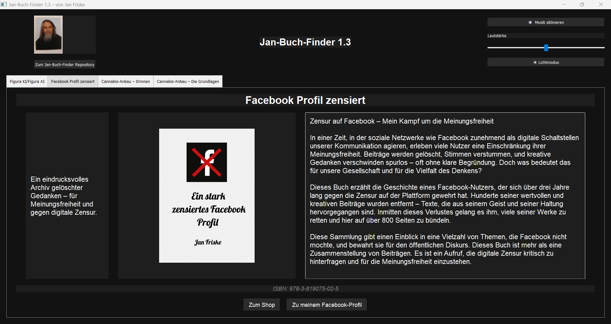

Perfekt! Hier ist die vorbereitete `README.md`-Datei für den lokalen Einsatz inklusive des Bildpfads für den Dunkelmodus-Screenshot. Stelle bitte sicher, dass sich der Screenshot mit dem Dateinamen `darkmode_screenshot.png` im selben Verzeichnis wie die `README.md` befindet oder passe den Pfad entsprechend an.

---

### 📄 Inhalt der `README.md` (lokal bereit zur Verwendung):

```markdown
# 📚 Jan-Buch-Finder

**Jan-Buch-Finder** ist eine Desktop-Anwendung, mit der du Bücher von **Jan Friske** durchsuchen und Informationen zu den verfügbaren Titeln anzeigen kannst.

Die Anwendung zeigt eine Liste von Büchern, deren **Cover**, **Kurz- und Langbeschreibungen**, sowie **ISBN** und einen **Shop-Link-Button**, um die Bücher zu erwerben.

---

## 🚀 Features

- Darstellung der Bücher mit Bild, Beschreibung, ISBN und Shop-Link
- Navigation über Tabs zwischen verschiedenen Titeln
- Lautstärkeregler und Musikfunktion (MP3)
- Hell-/Dunkelmodus umschaltbar
- Mit **Visual Studio** entwickelt (Projektdateien im Repository)
- Lokale JSON-Datei als Datenquelle (`buchdaten.json`)
- Eigenes Icon & MP3-Datei enthalten

---

## 🛠️ Installation & Ausführung

### Option 1: Ausführen per Python (empfohlen für Entwickler)

1. Stelle sicher, dass Python 3.x installiert ist.
2. Abhängigkeiten installieren (sofern nicht vorhanden):

   ```
   pip install PyQt5
   ```

3. Starte die Anwendung mit:

   ```
   python main.py
   ```

---

### Option 2: Windows-Executable nutzen

Navigiere in den Ordner `dist`. Dort findest du ausführbare Versionen des **Jan-Buch-Finder** in verschiedenen Ausbaustufen:

- `Version 1`
- `Version 1.1`
- `Version 1.2`
- `Version 1.3`

👉 Um eine Version herunterzuladen:

1. Klicke im Ordner `dist` auf die `.exe`-Datei der gewünschten Version.
2. In der nächsten Ansicht erscheint oben rechts ein **Dropdown-Menü** mit **Download-Option**.
3. Wähle dort „Download“, um die Anwendung herunterzuladen.

Die `.exe`-Dateien wurden mit Visual Studio erzeugt. Die zugehörigen `.spec`-Dateien und Builddaten sind im Repository enthalten.

---

## 🖥️ Benutzeroberfläche

Die App wurde mit **PyQt5** realisiert und bietet eine moderne, intuitive Benutzerführung – wahlweise im hellen oder dunklen Modus.

- 📸 Darstellung von Buchcovern, Autorenfoto und Icons
- 🎵 Musikuntermalung mit Lautstärkeregler
- 🌗 Licht-/Dunkelmodus-Umschaltung
- 🧩 Tabs zur Navigation zwischen den Büchern
- 🔗 Externe Buttons zu Shop & Social Media

---

### 🌑 Dunkelmodus (Dark Mode)

So sieht der **Dark Mode** der Anwendung aus:



> In dieser Ansicht ist das Buch *„Facebook Profil zensiert“* geöffnet. Die Tabs, Lautstärkeregler, Buttons und Texte passen sich automatisch dem gewählten Modus an.

---

## 📁 Projektstruktur

```
Jan-Buch-Finder/
├── covers/                     # Buchcover
├── dist/                       # Builds und ausführbare Dateien (.exe)
│   ├── Jan-Buch-Finder.exe     # Alle Versionen der Anwendung
│   └── ...                     # (Version 1, 1.1, 1.2, 1.3)
├── buchdaten.json              # Buchdaten (Titel, Beschreibung, ISBN etc.)
├── main.py                     # Hauptprogramm
├── main.spec                   # Build-Spezifikation
├── README.md                   # Diese Datei
├── LICENCE.txt                 # Lizenzinformationen
├── jan_icon.ico                # App-Icon
├── klassik.mp3                 # Hintergrundmusik
└── *.spec                      # Weitere Build-Dateien
```

---

## ℹ️ Lizenz

Dieses Projekt steht unter der **MIT-Lizenz**. Details findest du in der Datei `LICENCE.txt`.

---

## 👤 Autor

**Jan Friske**  
Website: [Link zum Shop oder Profil einfügen]  
GitHub: [https://github.com/JanFriske](https://github.com/JanFriske)

---

## ⭐ Feedback & Beiträge

Du hast eine Idee zur Verbesserung oder möchtest selbst etwas beitragen?  
Gerne! Forke das Projekt, erstelle einen Pull Request oder schreib direkt ein Issue.

---

Vielen Dank fürs Nutzen des Jan-Buch-Finder!
```
