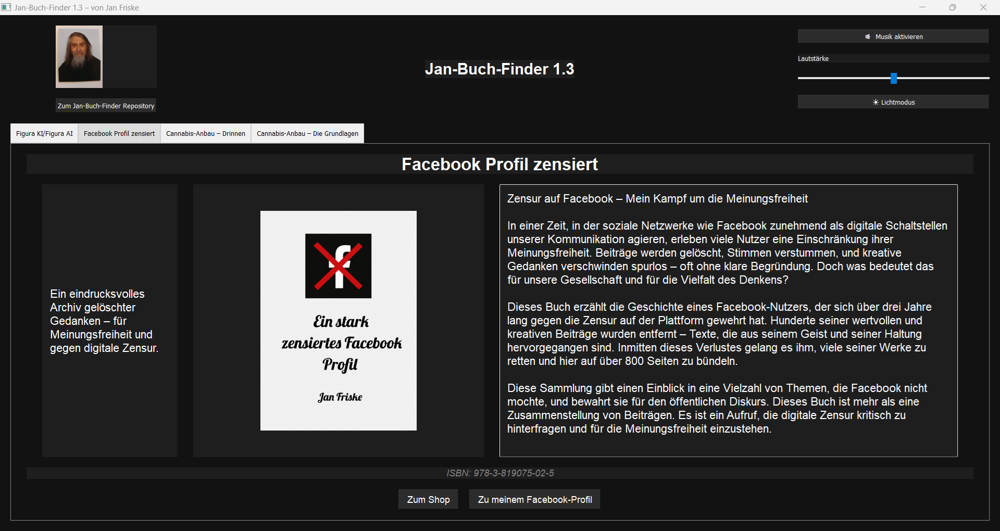

```markdown
# 📚 Jan-Buch-Finder

Jan-Buch-Finder ist eine Desktop-Anwendung, mit der du Bücher von
Jan Friske durchsuchen und Informationen zu den verfügbaren Titeln
anzeigen kannst. Die Anwendung zeigt eine Liste von Büchern, deren
Cover, Kurz- und Langbeschreibungen, sowie ISBN und einen
Shop-Link-Button, um die Bücher zu erwerben.

---

## 🚀 Features

- Darstellung der Bücher mit Bild, Beschreibung, ISBN und Shop-Link
- Navigation über Tabs zwischen verschiedenen Titeln
- Lautstärkeregler und Musikfunktion (MP3)
- Umschaltbarer Hell-/Dunkelmodus
- Mit Visual Studio entwickelt (Projektdateien im Repository)
- Lokale JSON-Datei als Datenquelle (`buchdaten.json`)
- Eigenes Icon & MP3-Datei enthalten

---

## 🛠️ Installation & Ausführung

### Option 1: Ausführen per Python (für Entwickler)

1. Python 3.x installieren.
2. Abhängigkeiten installieren:
   ```bash
   pip install PyQt5
   ```
3. Anwendung starten:
   ```bash
   python main.py
   ```

### Option 2: Nutzung der Windows-Executable

Navigiere in den Ordner `dist`, wo du 4 verschiedene
Versionen des Jan-Buch-Finder findest:

- `Version 1.0`
- `Version 1.1`
- `Version 1.2`
- `Version 1.3`

👉 **Download:**  
1. Klicke im Ordner `dist` auf die gewünschte `.exe`-Datei.  
2. Wähle im Dropdown-Menü oben rechts „Download“, um die Anwendung herunterzuladen.

Die `.exe`-Dateien wurden mit Visual Studio erstellt. Zugehörige main.py, `.spec`-Dateien und die buchdaten.json sind ebenfalls im Repository enthalten.

---

## 🖥️ Benutzeroberfläche

Die App wurde mit PyQt5 realisiert und bietet eine moderne, intuitive Benutzerführung – wahlweise im hellen oder dunklen Modus.

- 📸 Darstellung von Buchcovern, Autorenfoto und Icons
- 🎵 Musikuntermalung mit Lautstärkeregler
- 🌗 Umschaltbarer Licht-/Dunkelmodus
- 🧩 Navigation über Tabs
- 🔗 Externe Links zu Shop, Social Media & Repositories

---

### 🌑 Dunkelmodus (Dark Mode)

So sieht der Dunkelmodus der Anwendung aus:



> In dieser Ansicht ist das Buch *„Ein stark zensiertes Facebook Profil“* geöffnet. Die Tabs, Lautstärkeregler, Buttons und Texte passen sich automatisch dem gewählten Modus an.

---

```markdown

## 📁 Projektstruktur

Jan-Buch-Finder/
├── assets/                     # Screenshots, Icons etc. (z.B. darkmode_screenshot.png)
├── covers/                     # Buchcover
├── dist/                       # Builds und ausführbare Dateien (.exe)
│   ├── Jan-Buch-Finder.exe     # Alle Versionen der Anwendung
│   └── ...                     # (Version 1, 1.1, 1.2, 1.3)
├── buchdaten.json              # Buchdaten (Titel, Beschreibung, ISBN etc.)
├── main.py                     # Hauptprogramm
├── main.spec                   # Build-Spezifikation
├── README.md                   # Diese Datei
├── LICENCE.txt                 # Lizenzinformationen
├── jan_icon.ico                # App-Icon
├── klassik.mp3                 # Hintergrundmusik
└── *.spec                      # Weitere Build-Dateien

---

## Lizenz

Dieses Projekt steht unter der [MIT-Lizenz](LICENSE).

---

## 👤 Autor

**Jan Friske**  
Website: [Epubli-Shop](https://www.epubli.com/autoren/jan-friske-33400)]  
GitHub: [https://github.com/JanFriske](https://github.com/JanFriske)

---

## ⭐ Feedback & Beiträge

Vielen Dank, dass du Jan-Buch-Finder nutzt!  
Wenn du Fragen oder Anmerkungen hast oder dich beteiligen möchtest, freue ich mich über dein Feedback.
```


---

Vielen Dank fürs Nutzen des Jan-Buch-Finder!
```
